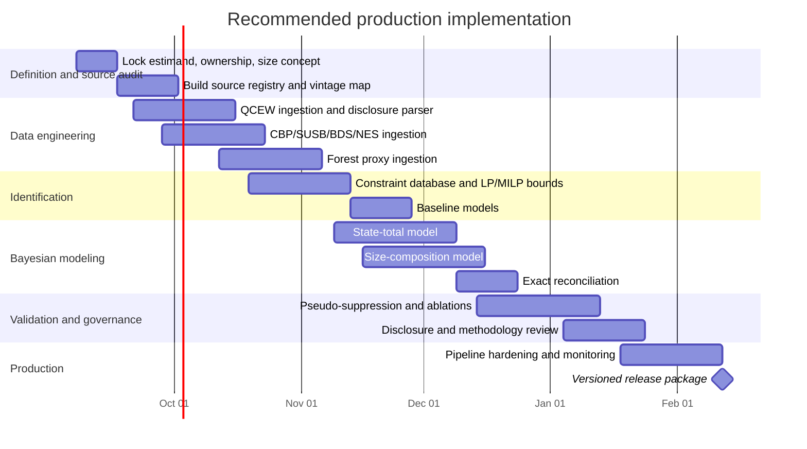

# Reproducible Estimation of Monthly U.S. State Logging Employment by Establishment Size Class

## Executive summary

The attached file is a 21,234-byte ASCII Markdown document, `logging-prompt.md`, containing 584 lines and 2,798 words. Its core assignment is to design a reproducible system for estimating monthly U.S. state employment in Logging, both in total and by establishment employment-size class, while distinguishing directly published observations, deterministic public-data constraints, proxies, and model-dependent estimates. The prompt explicitly supplies the string `"1113310"`, warns that it is probably intended to mean NAICS 113310, and requires that the code be verified rather than silently corrected. fileciteturn0file0

**The supplied seven-digit code is not a valid NAICS code. The intended six-digit code is almost certainly `113310 — Logging`.** NAICS uses two- through six-digit codes, and BLS's QCEW industry hierarchy explicitly lists `113310 Logging`. QCEW publishes NAICS-coded detailed industry data using the 2002 vintage for 1990–2006, 2007 for 2007–2010, 2012 for 2011–2016, 2017 for 2017–2021, and 2022 from 2022 forward. The official concordance materials examined do not indicate a substantive change to `113310 Logging` across those modern vintages; nevertheless, a production build should mechanically verify every relevant Census concordance workbook instead of relying on code-string continuity alone. citeturn17search8turn17search9turn17search7turn18search2

The best primary estimand is **QCEW-covered wage-and-salary jobs at establishments classified in NAICS 113310**, not persons employed and not jobs including proprietors. QCEW monthly employment counts workers who worked or received pay during the pay period including the 12th of the month; it covers workers subject to state UI laws and UCFE and is a near-census of payroll employment. For compatibility with CBP, SUSB, and QCEW's establishment-size product, I recommend making **private ownership (`own_code=5`) the core production target**, while retaining total covered employment as a separate optional series. citeturn17search4turn6search7

The most important research finding is that there is **no single public dataset that directly supplies the requested monthly state × six-digit Logging × establishment-size table**. Standard QCEW has the correct monthly state × six-digit employment intersection but no monthly size dimension. QCEW's separate establishment-size data are private-sector first-quarter data, with establishments classified by March employment; they are available nationally at six-digit NAICS but only by broad NAICS sector at the state level. Consequently, QCEW itself does **not** publicly provide state × six-digit Logging × size. citeturn17search6

CBP fills a crucial annual structural gap: its API schema simultaneously contains state geography, two- through six-digit industry, and establishment employment-size class, with employment measured during the week of March 12. Thus it can provide state × `113310` × establishment-size information for a March reference point. However, the latest available CBP vintage is 2023 and still uses **2017 NAICS**, not NAICS 2022; its employment magnitudes have historically been protected with noise infusion, and its current methodology page warns that Census is reconsidering disclosure-avoidance procedures following an administrative order prohibiting noise infusion. Existing vintages must therefore carry vintage-specific disclosure metadata. citeturn16search0turn16search3turn16search4turn16search5turn16search2

SUSB is useful but often misinterpreted for this problem. SUSB publishes establishments **by establishment industry and enterprise employment size**. The 2022 six-digit state file therefore supplies detailed Logging information classified by the size of the enterprise to which establishments belong—not by each establishment's own employment size. Its more detailed enterprise-size file reaches six-digit NAICS nationally but only NAICS sectors at state level. SUSB should be a hierarchical prior or sensitivity source, not substituted for establishment-size composition. citeturn24search0turn24search5turn24search10

The recommended architecture is therefore a **constrained hierarchical Bayesian small-area model**. Disclosed QCEW state-month Logging values remain fixed. For each month with a definitionally compatible national QCEW benchmark, the residual national employment after subtracting disclosed states is allocated only among suppressed states through normalized positive latent weights. This makes adding-up exact in every posterior draw rather than merely encouraging it with a penalty. State weights are predicted using establishment counts, state and regional effects, seasonal and year effects, robust state-specific dynamics, disclosed neighboring periods, broader-industry conditions, and a latent harvest-activity factor informed by Forest Service TPO/FIA data. Establishment-size composition is modeled separately with a logistic-normal process informed primarily by CBP March distributions and national QCEW size data. This is consistent with established small-area hierarchical estimation and compositional-data modeling principles. citeturn25search1turn25search5

A further key recommendation is to resolve the meaning of the size dimension **before modeling**. The most defensible primary output is:

\[
E_{s,t,k_y}
\]

where \(k_y\) is the establishment's **March-reference employment-size class for year \(y\)** and monthly employment is attributed to that annual class. This aligns with the QCEW size methodology and the CBP March reference period. A more ambitious estimand in which size class is recomputed every month, \(k_t\), is possible, but monthly transitions between size classes are not publicly observed at six-digit state detail and would add a substantial layer of model dependence. QCEW explicitly determines its size class from March employment. citeturn17search6

The biggest non-statistical risk is disclosure. QCEW national and higher-level totals include employment from suppressed detail cells, so accounting constraints can sometimes substantially narrow a suppressed cell. BLS itself suppresses detailed values to protect employer confidentiality, and Census disclosure methods similarly reflect establishment-level confidentiality concerns. A production system should therefore calculate deterministic feasible intervals internally but pass narrow or uniquely reconstructible results through an explicit disclosure review rather than automatically publishing them. citeturn25search3turn25search4turn16search2turn25search2

**Planning assumptions used in this report**

| Assumption | Working choice | Consequence |
|---|---|---|
| Historical period | Not supplied; design supports 1998 forward, with a 2017–2024 pilot recommended | CBP becomes available in the NAICS era; pilot minimizes historical-definition complexity |
| Core employment universe | Private QCEW-covered payroll jobs | Best compatibility with CBP/SUSB/QCEW size product |
| “Size” | Establishment employment size, preferably March-reference annual class | Avoids invalid firm/enterprise-size substitution |
| Geography | 50 states + D.C.; territories optional and separately controlled | Avoids mixing different geographic universes |
| Budget | Not supplied | Low/medium/high planning scenarios are estimates, not vendor quotes |
| Published output | Model estimate, never an official BLS/Census statistic | Requires provenance and disclosure labels |
| Current-vintage policy | Freeze every source extract and classification/disclosure metadata | Prevents silent changes from revisions or new disclosure treatments |

**Recommended budget envelope.** These are planning estimates based on loaded labor and engineering effort, not sourced market prices: a **low** pilot at roughly **$90k–$150k** over 8–12 weeks; a **medium** production-grade implementation at **$250k–$450k** over 16–22 weeks; and a **high** program at **$650k–$1.1m** over 28–40 weeks incorporating many state administrative feeds, independent validation, disclosure review, real-time vintaging, and operational support. Public federal datasets themselves generally do not require a data-purchase budget; commercial timberland or proprietary operating data, if introduced, should be budgeted separately.

## Verified target, classification, and direct-source findings

**Attachment and research objective.** The document asks for a data-identification and data-integration system rather than a search for a single table. It explicitly requires national adding-up where compatible, source-universe reconciliation, deterministic feasible bounds before statistical imputation, a hierarchical Bayesian model, pseudo-suppression validation, and a disclosure-risk review. fileciteturn0file0

**Classification and estimand**

| Question | Finding |
|---|---|
| Supplied code | `1113310` — **invalid as NAICS because it has seven digits**. NAICS search tools accept two- through six-digit codes. citeturn17search8 |
| Intended code | **NAICS 113310, Logging.** QCEW explicitly lists `113310 Logging`. citeturn17search7turn17search9 |
| Industry content | Logging includes establishments engaged in cutting timber, cutting and transporting timber, and producing wood chips in the field; related activities such as specialized timber trucking require careful cross-industry treatment. citeturn0search7 |
| QCEW vintage schedule | 2002 NAICS for 1990–2006; 2007 for 2007–2010; 2012 for 2011–2016; 2017 for 2017–2021; 2022 from 2022 forward. citeturn17search9 |
| 2022 implementation | QCEW introduced NAICS 2022 with first-quarter 2022 data. citeturn17search0 |
| Logging crosswalk | No substantive Logging-code change was identified in the official materials reviewed; this is an **inference requiring mechanical confirmation** against every Census concordance file before production. Census publishes the necessary vintage-to-vintage concordances. citeturn18search2 |
| Preferred employment concept | QCEW-covered wage-and-salary **jobs**, measured for the pay period including the 12th; not unique persons and not proprietors. citeturn17search4 |
| Preferred ownership | Private ownership for the primary model because the QCEW establishment-size product is private-sector and CBP/SUSB primarily measure employer businesses. QCEW provides explicit ownership codes for alternative totals. citeturn17search6turn6search7 |
| Statistical unit | Establishment/worksite. QCEW treats establishments of a multi-establishment firm separately for size classification. citeturn17search6 |
| Preferred size definition | Establishment employment size. Enterprise/firm size is a distinct variable and must not be substituted. SUSB's primary size dimension is enterprise size. citeturn24search5turn24search10 |

A subtle but important point is that a disclosed QCEW value should be treated as an **official published measurement**, not as error-free raw administrative truth. State agencies can impute employment and wages for late-reporting establishments, and those imputations may later be replaced during revision. For the proposed problem, the cleanest target is therefore “the final QCEW-equivalent published value that would have appeared absent disclosure suppression,” rather than an unobservable count of every actual worker. citeturn25search13turn17search2

**Direct-source inventory and verified dimensionality**

| Source | Exact usable access / dimensional finding | Role and limitations |
|---|---|---|
| **BLS QCEW standard** citeturn17search4turn17search10turn15view0 | Landing: `https://www.bls.gov/cew/data-overview.htm`. Open-data pattern documented as `https://data.bls.gov/cew/data/api/{year}/{quarter}/industry/{industry}.csv`; for Logging use `113310.csv`. Quarterly records contain `month1_emplvl`, `month2_emplvl`, `month3_emplvl`, quarterly establishments, wages, ownership, disclosure code, industry and aggregation level. | **Primary direct measurement.** State × month × six-digit industry exists. Employment can be suppressed. Higher-level totals incorporate undisclosed detail. Quarterly releases are revised. |
| **QCEW establishment-size product** citeturn17search6 | First quarter only; size determined by March employment. National data reach six-digit NAICS; state data reach only NAICS sector. | **Not** state × 113310 × size. National Logging size structure is valuable; state size structure cannot be directly observed here. Private sector only. |
| **Census CBP 2023** citeturn16search0turn16search3turn16search4turn16search5 | API: `https://api.census.gov/data/2023/cbp`. Variables include `NAICS2017`, `EMPSZES`, `ESTAB`, `EMP`, `EMP_F`, and `EMP_N`; state and six-digit industry are simultaneously queryable. Complete state file: `https://www2.census.gov/programs-surveys/cbp/datasets/2023/cbp23st.zip`. | **Best direct annual establishment-size anchor.** Employment is week of March 12. Current 2023 dataset still uses NAICS 2017. Existing CBP magnitudes reflect disclosure treatment, including noise flags. |
| **CBP disclosure metadata** citeturn16search2 | The methodology describes noise infusion since 2007; G/H/J flags correspond to increasing ranges of perturbation. Beginning in 2017, cells with fewer than three establishments are dropped rather than published. The page now warns its disclosure description is being reconsidered because of a Commerce administrative order prohibiting noise infusion. | Carry disclosure regime by reference year. Do not assume a count exists whenever employment is missing. Do not interpret noisy values as exact accounting identities. |
| **Census SUSB 2022** citeturn24search0turn24search1turn24search5 | `https://www.census.gov/data/datasets/2022/econ/susb/2022-susb.html`; six-digit state file is listed as `us_state_6digitnaics_2022`. SUSB reports establishment industry crossed with **enterprise employment size**. The “detailed employment sizes” file reaches U.S. six-digit industry but state NAICS sectors. | Valuable firm/enterprise structural prior, **invalid as direct establishment-size measurement**. Latest SUSB data remain 2022; industry uses NAICS 2017. |
| **Census BDS** citeturn19search0turn19search3turn19search8 | API: `https://api.census.gov/data/timeseries/bds`. 1978–2023 annual statistics; industry detail is sector, three-digit and four-digit NAICS. Size and age products exist, but API documentation explicitly warns that all desired characteristic crossings are not available. | Good structural proxy for establishment births/deaths, expansions/contractions and broader size dynamics; cannot directly supply six-digit Logging monthly size transitions. |
| **National CES** citeturn14search0turn13search1 | Monthly national payroll survey includes a Logging series under CES's own industry coding/aggregation conventions. | Timely national movement indicator; for retrospective QCEW estimation, national QCEW itself is the preferable exact benchmark. CES is sampled and revised, so do not force QCEW cells to equal CES. |
| **State CES** citeturn13search6 | Guaranteed state publication detail includes broad **Mining and Logging**, not six-digit Logging. | Monthly state-cycle proxy only; **not a direct substitute** for state NAICS 113310. |
| **OEWS** citeturn13search4turn13search7 | National industry-specific occupational employment/wage estimates are available for Logging, while state products generally describe occupations across industries rather than the required state × Logging employment total. | Potential occupational/wage structure proxy; low priority for total employment estimation. |
| **Forest Service TPO / NRUM** citeturn12search0turn12search1turn12search3turn12search10 | Forest Service products include roundwood production, mill receipts, retained production, exports/imports, logging residues, primary mills and interstate wood movement. | Strong annual/periodic physical-activity proxy. Prefer **harvest-origin production** to mill-location receipts when modeling labor demand because logs cross state boundaries. |
| **Forest Inventory and Analysis / EVALIDator** citeturn12search2turn12search4turn12search5 | FIA DataMart/EVALIDator provide inventory/removals estimates with sampling-error information. | Useful noisy measurement of latent harvest activity; temporal resolution is too low for standalone monthly allocation. Carry sampling uncertainty. |
| **Nonemployer Statistics** citeturn26search0turn26search2turn26search3 | API `https://api.census.gov/data/2023/nonemp`; variables include `NAICS2022`, `NESTAB`, receipts and flags. It covers businesses with **no paid employees**. | Not part of a QCEW payroll-job target. Strongest official proxy for sole-proprietor/nonemployer contractor activity if the target is broadened or such activity helps explain state logging conditions. |
| **BEA regional employment** citeturn20search12turn21search3 | BEA state employment covers full- and part-time jobs including wage/salary employment and self-employment, but detailed state tables `SAEMP25` and `SAEMP27` were discontinued on September 27, 2024. | Historical bridge/proxy only for detailed state industry employment. The conceptual universe differs from QCEW, and it is no longer a current production source for detailed state employment. |

The QCEW disclosure issue is material rather than hypothetical: BLS states that roughly 60 percent of its **most detailed county-by-industry** cells are suppressed, although that statistic should not be extrapolated as a suppression rate for state Logging cells. QCEW national and state industry totals include suppressed detail while protecting the underlying respondents. citeturn25search12turn25search4

The current source environment also creates a vintage asymmetry. QCEW switched to NAICS 2022 beginning with 2022 data, whereas CBP 2023 and SUSB 2022 are still published with NAICS 2017 industry fields. For Logging the code appears stable, making a bridge plausible, but the ETL should nevertheless store `source_naics_vintage` and validate the crosswalk rather than stripping vintage metadata. citeturn17search0turn16search3turn24search0

## Compatibility matrix and identified data gaps

The matrix below compares each source with the latent target. “Direct” means it measures the same economic concept closely enough to serve as an observation equation; “structural” means it informs a component of the target but cannot substitute for it.

| Source | Time/reference | Geography × industry | Statistical unit / size | Employment universe | Disclosure/value type | Compatibility |
|---|---|---|---|---|---|---|
| QCEW standard citeturn17search4turn25search4 | Monthly observations inside quarterly release | State × six-digit 113310 | Establishment; no size dimension in standard table | UI/UCFE covered payroll jobs; ownership explicit | Exact published value or suppressed; official estimates may contain establishment-level imputations | **Direct target anchor** |
| QCEW size citeturn17search6 | Q1; class based on March employment | National × six-digit **or** state × sector | Establishment employment size | Private payroll jobs | Direct where published | **Direct structure, wrong simultaneous geography/industry** |
| CBP citeturn16search0turn16search2 | Annual; week of March 12 | State × six-digit × establishment size | Establishment employment size | Employer establishments with paid employees | Noise-infused magnitude / flags; some cells dropped | **Best size-composition measurement** |
| SUSB citeturn24search5turn24search10 | Annual; week of March 12 | State × six-digit in basic enterprise-size file | Establishments classified by **enterprise size** | Employer businesses; most government excluded | Protected/edited published data | **Structural only—wrong size unit** |
| BDS citeturn19search3turn19search8 | Annual | State and up to four-digit industry; not every crossing | Establishment and firm size/age/dynamics | Employer establishments | Published disclosure flags | **Dynamics proxy** |
| National CES citeturn14search0turn13search1 | Monthly | National Logging | Establishment survey | Nonfarm payroll jobs | Sample estimate, revised/benchmarked | **Monthly national proxy; not exact QCEW identity** |
| State CES citeturn13search6 | Monthly | State Mining & Logging | Establishment survey | Nonfarm payroll jobs | Sample estimate | **Broader-industry proxy** |
| OEWS citeturn13search4turn13search7 | Annual/May reference | National Logging occupational detail; state occupational estimates | Jobs/occupations | Wage-and-salary employment | Sample/model estimates | **Weak structural proxy** |
| TPO/NRUM citeturn12search0turn12search10 | Periodic/annual-style forestry measurement | State/county; physical forest-product activity | Timber/output/mill unit | Not employment | Measurement/administrative survey | **Harvest-activity proxy** |
| FIA citeturn12search2turn12search4 | Inventory/evaluation period | State and smaller areas where estimable | Forest plots/resources | Not employment | Sample estimate with sampling errors | **Latent harvest measurement** |
| NES citeturn26search0turn26search3 | Annual | State × detailed NAICS | Nonemployer business | No paid employees | Published administrative statistic | **Proprietor/nonemployer proxy only** |
| BEA archive citeturn20search12turn21search3 | Annual historically | State with industry detail in discontinued tables | Jobs, not establishments | Wage/salary plus self-employment in total-employment concept | Modeled regional estimate | **Historical broad-concept regularizer** |

Several differences can reasonably be modeled: monthly versus March frequency can be bridged through a temporal state-space model; sampled or noise-infused observations can enter with source-specific measurement-error distributions; broader industry totals can regularize state temporal movement; and annual harvest information can identify persistent state-level activity factors. Differences in statistical unit and universe are more serious. **Enterprise size cannot be relabeled establishment size; nonemployer businesses cannot be counted as QCEW employees; BEA jobs including self-employment cannot be forced to equal QCEW payroll jobs; and state Mining & Logging CES employment cannot be substituted for six-digit Logging.** citeturn24search5turn26search0turn20search12turn13search6

**Principal identification gaps**

The first gap is the absence of monthly state × six-digit × establishment-size observations. The second is that the strongest public size anchors are March-centered, whereas the desired output is monthly. The third is disclosure: standard QCEW state-month Logging values may be withheld. The fourth is release-vintage mismatch—QCEW, CBP and SUSB can use different NAICS vintages for the same reference year. The fifth is source revision: QCEW now documents multiple revisions to quarter-level data, so reproducibility requires snapshotting exact release vintages, not repeatedly downloading “latest.” citeturn17search6turn16search0turn17search2

A particularly consequential definitional choice is whether the size class is **contemporaneous** or **March-defined**. QCEW's size product assigns each establishment to a size category based on March employment. Therefore, even when January and February employment fields occur on a first-quarter size record, the classification itself is determined by March. Treating these as January-size or February-size observations would be conceptually wrong. citeturn17search6

I recommend publishing two metadata fields:

\[
\texttt{size\_classification\_concept}
   \in \{\texttt{march\_reference},\texttt{contemporaneous\_modeled}\}
\]

and

\[
\texttt{employment\_concept}
   = \texttt{qcew\_covered\_payroll\_jobs}.
\]

The first should default to `march_reference`. A contemporaneous monthly-size product should only be produced as an explicitly higher-model-dependence extension.

**Disclosure pattern interpretation.** Never convert blank, zero-filled, missing or dropped source fields to substantive zero before interpreting the release's disclosure metadata. BLS explicitly withholds detailed QCEW values and historically has used unavailable/zero-filled fields in machine-readable data, while CBP changed from complementary suppression toward noise infusion and subsequently changed its small-cell publication policy. citeturn25search12turn16search2

The Census disclosure environment is currently itself a production risk. The current CBP methodology page says the historical noise-infusion description is no longer current because Census is evaluating alternatives following a Department of Commerce administrative order. Consequently, disclosure treatment should be part of the dataset schema—not buried in modeling documentation—and the ingestion pipeline should fail a schema/governance check if a new vintage introduces an unrecognized disclosure regime. citeturn16search2

## Proxy ranking and deterministic identification strategy

The proxy hierarchy should be different for the four latent tasks. A variable useful for monthly movement is not automatically useful for establishment-size composition.

| Target component | Ranked evidence | Mechanism and recommended use |
|---|---|---|
| **State total level** | QCEW establishment counts → nearby disclosed QCEW employment → CBP March employment/employee-per-establishment → broader QCEW forestry/logging conditions → latent TPO/FIA harvest activity | Establishment counts provide a direct exposure base; prior/adjacent employment identifies productivity/intensity; CBP anchors annual March scale; harvest provides physical-demand information. QCEW remains dominant. citeturn17search4turn16search4turn12search0 |
| **State size composition** | CBP state × 113310 × establishment size → QCEW national Logging size structure → historical state CBP structure → BDS broader-industry establishment-size dynamics → SUSB enterprise-size distribution | CBP measures the correct size unit at the relevant state/industry intersection. QCEW national structure provides hierarchical pooling. SUSB is deliberately ranked lower because it measures enterprise size. citeturn16search4turn17search6turn19search8turn24search10 |
| **Monthly movement/seasonality** | disclosed QCEW adjacent and same-month-prior-year observations → national CES Logging movement → state broader-industry QCEW/CES → weather/fire/road-access indicators where validated | Actual Logging employment history is strongest. CES can identify national contemporaneous shocks, while weather and access variables should enter only after out-of-sample validation. citeturn13search1turn13search6 |
| **Proprietor/nonemployer activity** | NES detailed state Logging → historical BEA self-employment/all-job measures → other tax/administrative data | These should not be added to a QCEW job target. They are useful only as predictors or for a separately defined “all workers/jobs” extension. citeturn26search0turn20search12 |

TPO and FIA should not be treated as independent votes for the same phenomenon. Both can contain information about harvest activity, but they measure that activity through different systems and reference periods. A better formulation introduces a latent \(H_{s,y}\), “harvest activity,” with TPO production and FIA removals as noisy measurements of that factor. TPO's geographic distinction between timber origin and mill receipts is particularly valuable because interstate wood flows can place a mill in a different state from the logging labor that harvested its input. citeturn12search0turn12search4turn12search10

Likewise, active primary mills and wood-products manufacturing demand have a plausible positive relationship with logging labor demand, but they can become redundant with harvest-volume variables. They belong in alternative proxy specifications or a common latent-factor model rather than being loaded simultaneously as if conditionally independent.

**Deterministic identification must precede Bayesian imputation.**

For every state-month target cell \(x_i\), first create a constraint database. Each restriction gets one of the prompt's requested labels:

\[
\{\text{public accounting fact},
  \text{definitional support},
  \text{empirical measurement},
  \text{modeling assumption},
  \text{sensitivity assumption}\}.
\]

For observed QCEW cells:

\[
x_i=e_i
\qquad
[\text{public accounting fact for the chosen release vintage}].
\]

For a compatible national total:

\[
\sum_{s\in S} x_{s,t}=N_t.
\]

For totals known only after rounding:

\[
N_t-\Delta_N \leq \sum_s x_{s,t}\leq N_t+\Delta_N.
\]

For a compatible parent industry or ownership margin:

\[
L_{p,t}\leq\sum_{i\in\mathcal C(p)}x_{i,t}\leq U_{p,t}.
\]

Employment and establishment counts should be constrained to nonnegative integers when they represent count realizations:

\[
x_i\in\mathbb Z_{\ge0}.
\]

For each suppressed cell, compute:

\[
L_i^\star=\min_{\mathbf x\in\mathcal F}x_i,
\qquad
U_i^\star=\max_{\mathbf x\in\mathcal F}x_i,
\]

where \(\mathcal F\) is the feasible region implied **only by public accounting and definitional restrictions**. Linear programming is sufficient when integrality does not change the result; mixed-integer linear programming is appropriate when integer counts or logical restrictions matter.

For size classes, a support bound such as

\[
L_k C_{s,t,k}\leq E_{s,t,k}\leq U_k C_{s,t,k}
\]

is valid only if \(C_{s,t,k}\) is an observed count of establishments classified under **the same size definition and reference period**. A March CBP count cannot be silently reused as the exact establishment count for November. Likewise, the open-ended largest size category has a defensible lower endpoint but no strict public upper bound unless another compatible margin supplies one.

This distinction yields two uncertainty objects that must remain separate in output:

\[
[L_i^\star,U_i^\star]
\]

is the **identified public-data feasible interval**, while

\[
[q_{0.025}(E_i\mid\text{model}),q_{0.975}(E_i\mid\text{model})]
\]

is a **posterior credible interval**. A narrow posterior inside a wide feasible interval is evidence of strong modeling assumptions, not stronger public identification.

QCEW's higher-level totals include undisclosed detailed values, making them potentially powerful constraints. They are usable only when geography, ownership, industry vintage and release vintage are identical. Mixing a final national value with preliminary state cells, for example, can create a residual that reflects revisions rather than suppression. citeturn25search3turn17search2

This constraint-solving stage should also produce a disclosure-risk flag. If public margins imply \(L_i^\star=U_i^\star\) for an officially suppressed cell—or an extremely narrow interval—the system should **not automatically publish the reconstructed number**. Instead, it should record that public cross-source information has effectively identified the cell and route it for disclosure review.

## Recommended Bayesian model and exact reconciliation

A useful model should separate three questions: total Logging employment, establishment-size composition, and employment intensity inside each size class. The proposed model keeps these components identifiable enough to diagnose failures rather than burying them in one black-box regression.

Let:

- \(s\) index states,
- \(t\) index months,
- \(y(t)\) denote calendar year,
- \(k\) index establishment-size categories,
- \(A_{s,t}\) denote Logging establishment exposure,
- \(E_{s,t}\) denote total target employment,
- \(p_{s,t,k}\) denote establishment-size shares,
- \(m_{s,t,k}\) denote expected employees per establishment in class \(k\).

The traditional decomposition

\[
E_{s,t,k}=A_{s,t}p_{s,t,k}m_{s,t,k}
\]

is economically intuitive, but it can be awkward because monthly \(A_{s,t,k}\) is generally unobserved. For production, I recommend using it to define **raw employment weights** and then normalize those weights so class totals exactly sum to the separately estimated state total.

**State-total latent score**

For a suppressed state-month, define

\[
\begin{aligned}
\log q_{s,t}
=&\;\log(A_{s,t}+\epsilon_A)
+\alpha
+u_s
+v_{r(s)}
+\gamma_{m(t)}
+\delta_{y(t)}\\
&+\boldsymbol\beta^\top X_{s,t}
+\lambda_H H_{s,t}
+\eta_{s,t}.
\end{aligned}
\]

Here \(u_s\) and \(v_{r(s)}\) are state and region effects; \(\gamma_m\) captures month-of-year seasonality; \(\delta_y\) is a year effect; \(X_{s,t}\) contains nonredundant predictors such as broader-industry employment and lagged state conditions; \(H_{s,t}\) is latent harvest activity; and \(A_{s,t}\) acts as an exposure rather than merely another regression covariate.

A robust AR process is preferable to a very smooth random walk:

\[
\eta_{s,t}
=
\rho_s\eta_{s,t-1}+\xi_{s,t},
\qquad
\xi_{s,t}\sim t_\nu(0,\sigma_{\eta,s}).
\]

The Student-\(t\) innovation admits exceptional closures, openings, disasters, coding corrections and large market shocks without forcing them to contaminate the entire time path. Explicit change-point indicators can be added if pseudo-suppression validation shows systematic gains.

This hierarchy is in the spirit of small-area shrinkage: local estimates borrow strength from auxiliary information and higher-level effects, rather than relying wholly on unstable small-cell histories. Fay and Herriot's foundational work demonstrated the central small-area principle of combining local measurements with regression/hierarchical information to reduce average error. citeturn25search1

**Exact national reconciliation**

Let \(D_t\) be disclosed states and \(U_t\) states requiring imputation. With a compatible national QCEW benchmark \(N_t\),

\[
R_t=N_t-\sum_{s\in D_t}E^{obs}_{s,t}.
\]

Keep every disclosed cell fixed:

\[
E_{s,t}=E^{obs}_{s,t},
\qquad s\in D_t.
\]

For suppressed states:

\[
\omega_{s,t}
=
\frac{\exp(\log q_{s,t})}
{\sum_{j\in U_t}\exp(\log q_{j,t})},
\]

and

\[
E_{s,t}=R_t\omega_{s,t},
\qquad s\in U_t.
\]

Therefore,

\[
\sum_s E_{s,t}=N_t
\]

**in every posterior draw**. No arbitrary tiny error variance is required.

When a national QCEW benchmark is unavailable or definitionally incompatible, drop this normalization and instead use whatever compatible parent intervals exist. A CES national estimate can be an observation equation or prior predictor, but not an exact identity with the QCEW target because CES is a sampled, benchmarked payroll survey. citeturn13search1turn14search0

**Harvest factor**

Instead of treating TPO and FIA as independent employment predictors:

\[
\log TPO_{s,y}
=
a_T+b_T H_{s,y}+\epsilon^{TPO}_{s,y},
\]

\[
\log FIA_{s,y}
=
a_F+b_F H_{s,y}+\epsilon^{FIA}_{s,y},
\]

with the FIA observation variance incorporating published sampling uncertainty where available. Monthly \(H_{s,t}\) can interpolate or evolve around annual/periodic \(H_{s,y}\), with monthly weather or permit data informing deviations only if validation supports them. Forest Service products provide the relevant harvest/removals and sampling-error information. citeturn12search0turn12search4

**Establishment-size composition**

Let an unconstrained vector \(z_{s,t,k}\) generate compositional shares:

\[
p_{s,t,k}
=
\frac{\exp(z_{s,t,k})}
{\sum_j \exp(z_{s,t,j})}.
\]

A logistic-normal specification is preferable to independent regressions because it guarantees positivity and adding-up while allowing flexible covariance among size shares. Logistic-normal analysis is rooted in the statistical treatment of compositions on the simplex developed by Aitchison. citeturn25search5

For the recommended March-reference definition:

\[
z_{s,t,k}
=
\bar z_{s,y(t),k}
+\theta_{m(t),k}
+\zeta_{s,t,k},
\]

where \(\bar z_{s,y,k}\) is the annual structural composition and \(\theta_{m,k}\) should initially be strongly shrunk toward zero. That means the default model does **not** invent strong month-by-size seasonality; such effects earn freedom only through validation.

For CBP March counts \(C^{CBP}_{s,y,k}\), one conceptual observation model is

\[
\mathbf C^{CBP}_{s,y}
\sim
\text{Multinomial}
\left(C^{CBP}_{s,y,+},\,
\mathbf p_{s,\text{Mar}(y)}\right),
\]

modified as necessary for dropped cells or disclosure treatment. CBP employment within a class can separately inform mean employees per establishment. Because CBP employment magnitudes have been noise-infused in existing releases, a measurement-error or interval likelihood is preferable to declaring noisy values exact. citeturn16search2turn16search3

SUSB enterprise-size shares should enter through a weaker relationship such as

\[
z_{s,y,k}
\sim N\left(
a_k+b_k\,g(\text{SUSB enterprise structure}_{s,y}),
\sigma^2_{SUSB,k}
\right),
\]

not as observations of \(p_{s,y,k}\), because enterprise and establishment size answer different questions. citeturn24search5turn24search10

**Employment per establishment by class**

For every closed size interval \([L_k,U_k]\),

\[
m_{s,t,k}
=
L_k+
(U_k-L_k)\operatorname{logit}^{-1}(\psi_{s,t,k}).
\]

This makes support violations impossible by construction. For the open-ended upper class,

\[
m_{s,t,K}=L_K+\exp(\psi_{s,t,K}),
\]

with a hierarchical heavy-tailed prior. The result is a probabilistic tail, **not** a claimed strict upper public bound.

Define raw employment shares:

\[
g_{s,t,k}=p_{s,t,k}m_{s,t,k},
\]

then

\[
\pi_{s,t,k}
=
\frac{g_{s,t,k}}{\sum_j g_{s,t,j}},
\]

and finally

\[
E_{s,t,k}=E_{s,t}\pi_{s,t,k}.
\]

This guarantees:

\[
\sum_kE_{s,t,k}=E_{s,t}
\]

for every posterior draw.

When compatible national size margins actually exist for a reference period, positive class weights can be matrix-scaled or otherwise reparameterized so both state rows and national size columns are satisfied. QCEW national six-digit size information is potentially valuable in the first quarter, but because size is determined by March employment it must not be misrepresented as contemporaneous monthly size membership. citeturn17search6

**Starting priors**

These are recommended modeling assumptions, not empirical facts:

\[
\beta_j\sim N(0,0.5^2)
\]

after continuous predictors are standardized;

\[
u_s\sim N(0,\sigma^2_u),\qquad
v_r\sim N(0,\sigma^2_v),
\]

with half-\(t_3\) or half-normal scale priors;

\[
\frac{\rho_s+1}{2}\sim\text{Beta}(8,2)
\]

to favor persistent but not necessarily unit-root dynamics;

\[
\nu=5
\]

as a robust starting innovation degrees-of-freedom value, with sensitivity runs at lighter and heavier tails.

The intercept should preferably be centered on the national disclosed employees-per-establishment level rather than assigned an arbitrary generic numerical mean.

**Measurement hierarchy**

| Evidence | Observation treatment |
|---|---|
| Disclosed final QCEW | Fix exactly when the estimand is the final published-QCEW equivalent |
| Preliminary QCEW | Separate release-vintage observation; never mix silently with final cells |
| QCEW suppressed | No pseudo-value; use feasible bounds and model |
| CBP employment | March structural observation with noise/flag treatment |
| CBP establishment-size counts | March size-composition measurement, conditioned on publication/disclosure status |
| SUSB enterprise size | Hierarchical prior/proxy, not direct establishment-size observation |
| FIA | Noisy harvest measurement using sampling errors |
| TPO | Noisy harvest-origin/activity measurement |
| CES | Monthly movement observation/predictor, not exact accounting margin |
| NES | Nonemployer-activity predictor only unless estimand explicitly includes proprietors |

**Suppression mechanism.** QCEW suppression should not be assumed missing completely at random: confidentiality risk naturally relates to small numbers of establishments, dominance/concentration and the structure of cells. But because the precise disclosure decision rule is not publicly known in enough detail to identify a full selection model, the system should not pretend to recover it. Instead, fit sensitivity variants with suppressed-cell residual scales multiplied by factors such as \(1.0,1.5,2.0\); shifted prior state shares; heavier employee-per-establishment tails; and pseudo-suppression patterns resembling primary and complementary suppression. BLS confirms that suppression exists to protect cooperating employers but does not publish a rule sufficient for a fully identified selection model. citeturn25search4turn25search12

**Posterior output schema**

Every state-month-size record should carry:

`posterior_mean`, `posterior_median`, `ci50_low/high`, `ci80_low/high`, `ci90_low/high`, `ci95_low/high`, `observed_or_imputed`, `qcew_disclosure_code`, `deterministic_lower`, `deterministic_upper`, `national_constraint_status`, `size_definition`, `ownership`, `naics_code`, `naics_vintage`, `source_release_vintage`, `model_version`, `proxy_set`, and selected posterior threshold probabilities.

Posterior draws should be retained jointly. Publishing only marginal intervals destroys information about the strong negative dependence induced by exact national reconciliation.

For integerized published point estimates, first retain continuous posterior expected jobs. When an integer table is needed, floor each cell and distribute the remaining jobs according to fractional remainders under a controlled/balanced rounding algorithm, with a second balancing step for any simultaneously imposed class margins. The rounded table should be tested after rounding for all required row and column totals.

## Alternatives, validation, and disclosure-risk assessment

The Bayesian system should not go into production merely because it is sophisticated. It should beat transparent baselines on deliberately difficult pseudo-suppression tests.

| Method | Strength | Main weakness | Expected role |
|---|---|---|---|
| Equal residual allocation | Completely transparent | Ignores state scale | Sanity-check lower baseline |
| Establishment-count proportional | Uses direct exposure | Assumes equal employees/establishment | Strong simple baseline |
| Last observed state share | Preserves state heterogeneity | Fails after structural breaks | Short gaps |
| Same-month previous-year share | Captures annual seasonality | Slow to react to shocks | Strong seasonal baseline |
| Rolling/EW historical share | Stable, adapts gradually | Can lag regime changes | General baseline |
| CBP employees-per-establishment × QCEW establishment count | Strong annual level anchor | March-centered, noisy, stale between CBP releases | **Best transparent structural baseline** |
| Harvest-volume proportional | Economic physical mechanism | Labor productivity varies; timing mismatch | Proxy benchmark, not preferred standalone |
| Constrained regression + reconciliation | Explainable and easy to productionize | Understates parameter/model uncertainty | **Best fallback if Bayesian gains are weak** |
| Bayesian without forestry proxies | Tests incremental value of TPO/FIA | Less economic information | Required ablation |
| Bayesian without temporal smoothing | Tests whether dynamics actually help | High variance | Required ablation |

If the full system does not materially outperform the **CBP/QCEW employee-per-establishment baseline followed by exact national reconciliation**, I recommend deploying the simpler constrained approach. Complexity should earn its place through out-of-sample performance.

**Validation design**

Random masking alone is inadequate because official suppression is structurally related to small or concentrated cells. Validation should therefore create several pseudo-suppression regimes from disclosed QCEW cells:

| Holdout regime | What it tests |
|---|---|
| Small-cell-biased masking | Performance where suppression is most plausible |
| Concentration-risk masking | Robustness to unusual employees-per-establishment |
| Long consecutive state gaps | Dynamic interpolation and trend recovery |
| Whole-state/year or regional groups | Cross-sectional partial pooling |
| Whole seasonal blocks | Ability to reconstruct seasonality |
| Rolling-origin prediction | Real-time usefulness without future information |
| Retrospective smoothing | Best historical reconstruction using both past and future |
| Structural-break windows | Openings, closures, disasters, market shifts |
| NAICS transition windows | Classification robustness |
| Preliminary-to-final holdouts | Revision-vintage sensitivity |

QCEW's documented revision process justifies explicitly separating real-time preliminary performance from retrospective final-data reconstruction. citeturn17search2turn25search12

Primary point metrics should be MAE and RMSE, plus WAPE where aggregate scale matters. Median absolute percentage error is useful only after excluding or separately treating zero/near-zero denominators. Also measure absolute state-share error:

\[
\left|
\frac{\hat E_{s,t}}{\sum_j\hat E_{j,t}}
-
\frac{E_{s,t}}{\sum_jE_{j,t}}
\right|,
\]

and analogous size-share error.

Probabilistic validation should report empirical coverage and average width for the 50%, 80%, 90% and 95% intervals, plus proper scoring rules such as CRPS or logarithmic score. Constraint tests should be binary and unforgiving: national totals, disclosed state values, state class totals and any valid public margins must have **zero numerical violations within tolerance**.

Calibration results should be stratified by state employment size, gap duration, geographic region, disclosure-risk proxy, and degree of extrapolation beyond the nearest observed CBP year.

**Ablation and sensitivity requirements**

The production candidate should be re-estimated without forestry proxies, without temporal smoothing, with alternative temporal priors, with more diffuse state effects, with heavier suppressed-cell tails, with and without CES information, and under different mappings of CBP noise flags into observation variance. If conclusions change materially, those changes belong in the published uncertainty/sensitivity record.

**Disclosure-risk assessment**

This project estimates aggregate economic activity and should never attempt to identify individual employers. Nevertheless, the integration of multiple public margins can create reconstruction risk.

The following cases should automatically trigger manual review:

1. an officially suppressed QCEW cell receives an exact deterministic public-data solution;
2. the feasible interval is extremely narrow relative to the cell magnitude;
3. a state-size-class estimate effectively implies employment at one known dominant Logging establishment;
4. a posterior interval is far narrower than its public-data feasible interval because of aggressive priors;
5. combining state totals, class counts and public employer information would make an establishment readily inferable;
6. a coarser state-year, regional-month, or broader size grouping would adequately answer the economic question.

BLS explicitly states that detailed QCEW values are withheld when necessary to protect employer identity, while Census has developed perturbation/noise methods precisely to increase table availability without revealing respondent values. Those objectives should not be inadvertently defeated by a model that republishes mathematically reconstructed confidential cells. citeturn25search4turn25search2

Recommended remedies, in increasing order of restriction, are wider published intervals, combining adjacent size classes, annual rather than monthly publication for highly concentrated states, regional aggregation, suppression of selected model outputs, or restricted analyst access. Every record must clearly say **“modeled estimate; not an official BLS or Census published value.”**

## Production pipeline, budget, timeline, and deliverables

The operational system should treat source metadata and constraints as first-class datasets rather than one-time documentation.

```mermaid
flowchart LR
    A[Source registry<br/>URL, vintage, universe, NAICS] --> B[Immutable raw snapshots]
    B --> C[Schema and disclosure parsing]
    C --> D[Concept harmonization<br/>geography, ownership, units]
    D --> E[Constraint engine]
    E --> F[LP/MILP feasible bounds]
    D --> G[Proxy feature store]
    F --> H[Bayesian state-total model]
    G --> H
    D --> I[Size-structure model]
    H --> J[Exact national reconciliation]
    I --> K[Within-state size allocation]
    J --> K
    K --> L[Joint posterior draws]
    L --> M[Validation and ablation]
    M --> N[Disclosure-risk review]
    N --> O[Balanced rounding / publication]
    O --> P[Versioned output and audit package]
```



The pipeline should refuse to run when a source vintage introduces an unknown NAICS version, disclosure code, ownership definition or schema field. This is especially important because CBP's disclosure regime is currently under review and QCEW data are revised after initial release. citeturn16search2turn17search2

**Technical requirements**

The data layer needs immutable downloads with checksums, extraction timestamps, source publication dates, original filenames and query strings; a NAICS-vintage crosswalk dimension; state FIPS harmonization; ownership mappings; source-universe metadata; and source-specific disclosure parsers. QCEW quarterly observations should be stored in normalized monthly form while retaining the parent quarter and release vintage.

The statistical layer needs an LP/MILP solver, a Bayesian engine capable of hierarchical state-space models and posterior-draw transformations, deterministic reconciliation tests, reproducible random seeds, posterior diagnostics, and pseudo-suppression evaluation. No model should be promoted if convergence diagnostics or adding-up tests fail.

The governance layer needs peer review of classification decisions, reproducibility tests from raw source snapshot to final table, disclosure review, model cards, change logs, and clear separation of official observations from imputed estimates.

**Stakeholders**

The core stakeholders are labor-statistics researchers who define the estimand; data engineers who own extraction and vintaging; Bayesian/small-area modelers; forestry economists who validate harvest proxies; BLS/Census/Forest Service source stewards where methodological clarification is needed; privacy/disclosure reviewers; and downstream economists or product teams who consume the estimates. The critical governance principle is separation of responsibilities: model developers should not be the sole approvers of disclosure-sensitive outputs.

**Medium-scope implementation plan**



The schedule is intentionally staged so the feasibility engine and transparent baselines exist **before** the full Bayesian model. A discovery result that the public constraints or CBP/QCEW baseline already provide adequate accuracy can therefore reduce both cost and complexity.

**Budget scenarios**

| Scenario | Approximate cost | Calendar | Included | Explicitly deferred |
|---|---:|---:|---|---|
| **Low / research pilot** | **$90k–$150k** | 8–12 weeks | QCEW + CBP, classification audit, deterministic bounds, 3–4 transparent baselines, simplified Bayesian totals, prototype size model, retrospective validation | TPO/FIA integration, extensive state admin data, real-time production, independent privacy review |
| **Medium / recommended** | **$250k–$450k** | 16–22 weeks | Full QCEW/CBP/SUSB/BDS/NES source layer, TPO/FIA factor, LP/MILP bounds, hierarchical totals and size model, exact reconciliation, pseudo-suppression suite, governance, reproducible production pipeline | Broad 50-state bespoke permits/tax sources, commercial data |
| **High / institutional** | **$650k–$1.1m** | 28–40 weeks | Medium scope plus state-specific harvest/tax/permit feeds, weather/fire access features, real-time vintage estimation, independent replication, formal disclosure review, production monitoring and extensive documentation | Commercial data licensing remains separate unless specifically procured |

These estimates assume a mix of senior statistical modeling, data engineering, forestry-domain review and privacy/governance time. They are scenario assumptions rather than claims about required government or vendor pricing.

**Deliverables**

| Deliverable | Minimum acceptance criterion |
|---|---|
| Classification memo | Explicit `1113310` disposition; verified `113310`; NAICS-vintage map |
| Source registry | One machine-readable record per source, exact access path/status and concepts |
| Raw-data archive | Immutable snapshots with checksums and retrieval dates |
| Harmonized analytical database | Monthly QCEW, annual structure/proxy sources, standardized state/NAICS metadata |
| Constraint table | Every restriction labeled accounting/support/measurement/model/sensitivity |
| Feasible-bound engine | Recomputes cellwise LP/MILP lower and upper bounds |
| Baseline package | All required transparent allocation baselines |
| Bayesian model | Joint draws; exact disclosed-state and national reconciliation |
| Size-class model | Establishment-size concept explicit; class support respected |
| Validation report | Pseudo-suppression, rolling-origin, structural-break and ablation results |
| Disclosure report | Flags exact/narrow reconstruction and high-concentration outputs |
| Release dataset | Means/medians, requested credible intervals, bounds, status and provenance |
| Reproducibility package | Environment lock, source manifest, model version, tests, end-to-end build command |

A production release should only be accepted when a clean environment can rebuild the estimates from the frozen source manifest and reproduce all accounting totals, validation statistics and disclosure flags.

## Machine-readable source inventory, access examples, bibliography, and unresolved questions

**Reproducible API/access examples**

QCEW's open-data documentation describes static CSV slices rather than a key-authenticated JSON API. The Logging-industry pattern is therefore:

```bash
curl -fL \
  'https://data.bls.gov/cew/data/api/2024/1/industry/113310.csv' \
  -o qcew_2024_q1_113310.csv
```

The URL pattern and CSV field structure are documented by BLS; the exact `113310` request could not be executed from this research runtime because outbound container DNS was unavailable, so the specific request is marked **DOCUMENTED**, not falsely labeled executed. QCEW documentation shows that industry slices include industry, ownership, aggregation/size metadata, disclosure codes, establishments, three monthly employment values and wages. citeturn15view0

For CBP, current Census documentation states that **all Census Data API queries now require an API key**. The following 2023 Alabama request uses the dataset's actual `NAICS2017` predicate and all-establishment size code shown in official examples: citeturn16search0turn16search5

```bash
curl -G 'https://api.census.gov/data/2023/cbp' \
  --data-urlencode 'get=NAME,NAICS2017_LABEL,ESTAB,EMP,EMP_F,EMP_N' \
  --data-urlencode 'for=state:01' \
  --data-urlencode 'NAICS2017=113310' \
  --data-urlencode 'LFO=001' \
  --data-urlencode 'EMPSZES=001' \
  --data-urlencode 'key=YOUR_KEY'
```

For class-specific retrieval, production code should enumerate the official `EMPSZES` metadata and iterate its verified codes rather than hard-coding codes from another Census product. The CBP API schema confirms that establishment size, state, NAICS, employment, establishments and noise/flag variables coexist in this dataset. citeturn16search3turn16search4

BDS cannot accept six-digit `113310` as the required industry detail because BDS industry statistics stop at sector, three-digit and four-digit NAICS. The closest Logging-industry request is therefore correctly written with `1133`, rather than inventing a six-digit BDS series: citeturn19search3turn19search8

```bash
curl -G 'https://api.census.gov/data/timeseries/bds' \
  --data-urlencode 'get=NAME,NAICS_LABEL,YEAR,EMP,ESTAB,JOB_CREATION' \
  --data-urlencode 'for=state:01' \
  --data-urlencode 'time=2023' \
  --data-urlencode 'NAICS=1133' \
  --data-urlencode 'key=YOUR_KEY'
```

For Nonemployer Statistics, the official 2023 dataset uses NAICS 2022 and exposes `NESTAB` and receipts: citeturn26search0turn26search2turn26search3

```bash
curl -G 'https://api.census.gov/data/2023/nonemp' \
  --data-urlencode 'get=NAME,NAICS2022_LABEL,NESTAB,NRCPTOT' \
  --data-urlencode 'for=state:01' \
  --data-urlencode 'NAICS2022=113310' \
  --data-urlencode 'LFO=001' \
  --data-urlencode 'RCPSZES=001' \
  --data-urlencode 'key=YOUR_KEY'
```

Current Census pages say a key is required for these datasets. An older Census query-limits page documents a maximum of 50 requested variables per query and an older 500-queries-per-IP/day no-key threshold, but that no-key guidance has been superseded for CBP/BDS/NES by the newer mandatory-key notices. The 2026 API-key guide confirms free key registration. A dataset-specific pagination mechanism was not verified; these aggregate requests should therefore be partitioned deterministically by year, state and category as needed and cached locally. citeturn26search7turn26search10turn16search0turn19search3

**Machine-readable inventory**

```json
[
  {
    "agency": "U.S. Bureau of Labor Statistics",
    "dataset": "Quarterly Census of Employment and Wages",
    "table_or_endpoint": "QCEW Open Data industry CSV slice; industry=113310",
    "url": "https://data.bls.gov/cew/data/api/{YEAR}/{QTR}/industry/113310.csv",
    "access_date": "2026-09-03",
    "years_available": "Detailed NAICS-coded QCEW data 1990-forward; source-specific NAICS vintages apply",
    "release_frequency": "Quarterly, with annual files and revisions",
    "reference_period": "Monthly employment within quarter; pay period including the 12th",
    "geography": "State, county, national and other published aggregates",
    "industry_detail": "Through six-digit NAICS",
    "ownership": "Total covered, federal, state, local, private and documented aggregates",
    "statistical_unit": "Establishment/worksite",
    "employment_concept": "UI/UCFE-covered wage-and-salary jobs",
    "size_dimension": "Not part of standard monthly state x six-digit table",
    "suppression_or_noise": "Employment/wage detail can be suppressed; disclosure_code must be parsed",
    "revision_status": "Multiple release revisions; freeze exact source vintage",
    "proposed_model_role": "Primary direct state-month observation and national accounting benchmark",
    "important_limitations": "Suppression; establishment-level imputations for delinquent reports; preliminary/final vintage mixing is invalid"
  },
  {
    "agency": "U.S. Bureau of Labor Statistics",
    "dataset": "QCEW Establishment Size Data",
    "table_or_endpoint": "First-quarter establishment-size files/Open Data",
    "url": "https://www.bls.gov/cew/classifications/size/size-data-info.htm",
    "access_date": "2026-09-03",
    "years_available": "Annual first-quarter files; verify requested historical range in file catalog",
    "release_frequency": "Annual first-quarter size product",
    "reference_period": "Size class determined by March employment",
    "geography": "National at six-digit NAICS; state only at NAICS sector",
    "industry_detail": "National six-digit; state sector",
    "ownership": "Private sector",
    "statistical_unit": "Establishment",
    "employment_concept": "QCEW-covered private payroll jobs",
    "size_dimension": "Establishment employment size",
    "suppression_or_noise": "QCEW confidentiality rules apply",
    "revision_status": "Tied to QCEW release vintages",
    "proposed_model_role": "National Logging size prior/reference-period margin",
    "important_limitations": "No public state x six-digit Logging x size intersection; March-based class cannot be called contemporaneous monthly size"
  },
  {
    "agency": "U.S. Census Bureau",
    "dataset": "County Business Patterns",
    "table_or_endpoint": "2023 CBP API and cbp23st.zip",
    "url": "https://api.census.gov/data/2023/cbp",
    "access_date": "2026-09-03",
    "years_available": "1986-forward overall; NAICS from 1998; latest 2023",
    "release_frequency": "Annual",
    "reference_period": "Employment during week of March 12",
    "geography": "U.S., state, county and selected other geographies",
    "industry_detail": "Two- through six-digit; 2023 API uses NAICS2017",
    "ownership": "Employer business universe; LFO dimension available at U.S./state",
    "statistical_unit": "Establishment",
    "employment_concept": "Paid employees",
    "size_dimension": "Establishment employment-size class",
    "suppression_or_noise": "Historical 2007+ noise infusion for magnitudes; flags; cells under three establishments dropped beginning 2017; disclosure regime now under review",
    "revision_status": "Annual vintage-specific product",
    "proposed_model_role": "Primary March state x Logging establishment-size measurement",
    "important_limitations": "Annual/March only; noisy or dropped cells; 2023 remains NAICS 2017"
  },
  {
    "agency": "U.S. Census Bureau",
    "dataset": "Statistics of U.S. Businesses",
    "table_or_endpoint": "2022 U.S. & states six-digit NAICS; detailed enterprise-size file",
    "url": "https://www.census.gov/data/datasets/2022/econ/susb/2022-susb.html",
    "access_date": "2026-09-03",
    "years_available": "U.S./state annual online series 1997-forward; latest 2022",
    "release_frequency": "Annual, approximately 2-2.5 years after reference year",
    "reference_period": "Employment during week of March 12",
    "geography": "U.S., states, MSA, county and other products",
    "industry_detail": "Through six-digit NAICS in U.S./state file",
    "ownership": "Paid-employer businesses; most government excluded",
    "statistical_unit": "Establishment records tabulated by enterprise characteristics",
    "employment_concept": "Paid employees",
    "size_dimension": "Enterprise employment size, not establishment employment size",
    "suppression_or_noise": "Disclosure-protected published tabulations",
    "revision_status": "Annual; errata/replacement files can occur",
    "proposed_model_role": "Enterprise-structure prior/sensitivity variable",
    "important_limitations": "Do not substitute enterprise size for establishment size; detailed size x state reaches only NAICS sectors"
  },
  {
    "agency": "U.S. Census Bureau",
    "dataset": "Business Dynamics Statistics",
    "table_or_endpoint": "BDS time-series API",
    "url": "https://api.census.gov/data/timeseries/bds",
    "access_date": "2026-09-03",
    "years_available": "1978-2023",
    "release_frequency": "Annual",
    "reference_period": "Annual business dynamics",
    "geography": "National, state, metro/nonmetro, county in available products",
    "industry_detail": "Sector, three-digit and four-digit NAICS",
    "ownership": "Employer business universe represented in LBD/BDS",
    "statistical_unit": "Establishment and firm",
    "employment_concept": "Employment and job creation/destruction",
    "size_dimension": "Firm and establishment size products; crossings limited",
    "suppression_or_noise": "Published disclosure flags",
    "revision_status": "Annual releases",
    "proposed_model_role": "Broader-industry birth/death/size-transition structural prior",
    "important_limitations": "No six-digit 113310 industry detail and not all size x industry x geography crossings exist"
  },
  {
    "agency": "U.S. Bureau of Labor Statistics",
    "dataset": "Current Employment Statistics",
    "table_or_endpoint": "National Logging and state guaranteed-publication series",
    "url": "https://www.bls.gov/ces/",
    "access_date": "2026-09-03",
    "years_available": "Series-dependent",
    "release_frequency": "Monthly",
    "reference_period": "Payroll survey reference pay period",
    "geography": "National; state products",
    "industry_detail": "National Logging available; state guaranteed detail generally Mining and Logging",
    "ownership": "Nonfarm payroll universe according to CES definitions",
    "statistical_unit": "Establishment/worksite sample",
    "employment_concept": "Payroll jobs",
    "size_dimension": "None suitable for target",
    "suppression_or_noise": "Sample estimates, sampling error and publication criteria rather than QCEW cell suppression",
    "revision_status": "Monthly revisions and benchmark revisions",
    "proposed_model_role": "Timely national/monthly movement proxy",
    "important_limitations": "Not an exact QCEW accounting benchmark; state industry detail too broad"
  },
  {
    "agency": "USDA Forest Service",
    "dataset": "Timber Products Output / National Resource Use Monitoring",
    "table_or_endpoint": "TPO/NRUM data downloads and interactive products",
    "url": null,
    "access_date": "2026-09-03",
    "years_available": "Historical and current survey/evaluation years; state schedules vary",
    "release_frequency": "Periodic rather than uniformly monthly",
    "reference_period": "Survey/reference-year timber production and mill activity",
    "geography": "State/county and regional products",
    "industry_detail": "Physical forest-product activity rather than NAICS payroll cells",
    "ownership": "Resource/output measures",
    "statistical_unit": "Timber output, mills, product flows",
    "employment_concept": "None",
    "size_dimension": "None applicable",
    "suppression_or_noise": "Source-specific survey/data-quality controls",
    "revision_status": "Vintage-specific",
    "proposed_model_role": "Measurement of latent harvest activity",
    "important_limitations": "Not monthly employment; distinguish harvest origin from mill receipts; exact raw landing URL should be captured from the cited Forest Service page in implementation manifest"
  },
  {
    "agency": "USDA Forest Service",
    "dataset": "Forest Inventory and Analysis / EVALIDator",
    "table_or_endpoint": "FIA DataMart, EVALIDator and FIADB access",
    "url": "https://apps.fs.usda.gov/fia/datamart/datamart.html",
    "access_date": "2026-09-03",
    "years_available": "Inventory-cycle and historical FIADB data",
    "release_frequency": "Continuously/periodically updated inventory data",
    "reference_period": "Inventory evaluation period",
    "geography": "State and supported inventory domains",
    "industry_detail": "Forest/resource measures, not NAICS payroll",
    "ownership": "Forest-land/resource universe",
    "statistical_unit": "Inventory plots/resources",
    "employment_concept": "None",
    "size_dimension": "None applicable",
    "suppression_or_noise": "Sampling-error estimates available for many EVALIDator estimates",
    "revision_status": "Database/evaluation vintage",
    "proposed_model_role": "Noisy measurement of latent removals/harvest activity",
    "important_limitations": "Temporal resolution is much lower than monthly employment; carry sampling uncertainty"
  },
  {
    "agency": "U.S. Census Bureau",
    "dataset": "Nonemployer Statistics",
    "table_or_endpoint": "2023 Nonemployer API",
    "url": "https://api.census.gov/data/2023/nonemp",
    "access_date": "2026-09-03",
    "years_available": "1997-2023 API/file series",
    "release_frequency": "Annual",
    "reference_period": "Annual administrative/tax-based business statistics",
    "geography": "National, state, county and selected statistical areas",
    "industry_detail": "Detailed NAICS; 2023 uses NAICS2022",
    "ownership": "Legal-form dimension available at U.S./state",
    "statistical_unit": "Nonemployer business",
    "employment_concept": "No paid employees; establishments and receipts only",
    "size_dimension": "Receipts size at U.S. level, not paid-employment size",
    "suppression_or_noise": "Publication flags; methodological changes from 2022 affect comparability",
    "revision_status": "Annual",
    "proposed_model_role": "Nonemployer/proprietor activity proxy or separate expanded-universe estimate",
    "important_limitations": "Must never be added directly to QCEW payroll employment"
  },
  {
    "agency": "U.S. Bureau of Economic Analysis",
    "dataset": "Regional Employment",
    "table_or_endpoint": "Employment by State; archived SAEMP25/SAEMP27",
    "url": "https://www.bea.gov/data/employment/employment-by-state",
    "access_date": "2026-09-03",
    "years_available": "Historical archives; detailed state employment tables discontinued in 2024",
    "release_frequency": "Regional-account release schedule",
    "reference_period": "Annual for relevant historical detailed employment",
    "geography": "State",
    "industry_detail": "Historical detailed industry tables",
    "ownership": "Regional economic-account universe",
    "statistical_unit": "Jobs",
    "employment_concept": "Total full-/part-time jobs includes wage/salary and self-employment; separate wage/salary table historically existed",
    "size_dimension": "None",
    "suppression_or_noise": "Modeled regional estimates and source-specific disclosure",
    "revision_status": "Regional estimates revised; SAEMP25/SAEMP27 discontinued September 27, 2024",
    "proposed_model_role": "Historical broad-concept regularizer only",
    "important_limitations": "Different employment universe and no current detailed-state production table"
  }
]
```

The `null` TPO URL is intentional rather than fabricated: the official Forest Service TPO/NRUM landing pages were successfully identified and examined during research, but the raw current URL was not safely retained in a form I can reproduce with confidence. The production source registry should resolve that one field from the cited official page before code is committed. The underlying TPO/NRUM findings in this report are based on official Forest Service sources. citeturn12search0turn12search1

**Bibliography and working access points — accessed September 3, 2026**

U.S. Census Bureau, *North American Industry Classification System*.  
`https://www.census.gov/naics/` citeturn17search8

U.S. Census Bureau, *NAICS Concordances*.  
`https://www.census.gov/naics/concordances/concordances.html` citeturn18search2

U.S. Bureau of Labor Statistics, *QCEW Industry Codes and Titles*.  
`https://www.bls.gov/cew/classifications/industry/industry-titles.htm` citeturn17search9

U.S. Bureau of Labor Statistics, *QCEW Introduces NAICS 2022 Industry Coding*.  
`https://www.bls.gov/cew/classifications/industry/naics-2022.htm` citeturn17search0

U.S. Bureau of Labor Statistics, *QCEW Data Overview*.  
`https://www.bls.gov/cew/data-overview.htm` citeturn17search10

U.S. Bureau of Labor Statistics, *Establishment Size Data Available from QCEW*.  
`https://www.bls.gov/cew/classifications/size/size-data-info.htm` citeturn17search6

U.S. Bureau of Labor Statistics, *QCEW Questions and Answers*.  
`https://www.bls.gov/cew/questions-and-answers.htm` citeturn25search12

U.S. Bureau of Labor Statistics, *QCEW Revisions*.  
`https://www.bls.gov/cew/revisions/` citeturn17search2

U.S. Census Bureau, *County Business Patterns APIs*.  
`https://www.census.gov/data/developers/data-sets/cbp-zbp/cbp-api.html` citeturn16search0

U.S. Census Bureau, *2023 CBP API Variables*.  
`https://api.census.gov/data/2023/cbp/variables.html` citeturn16search3

U.S. Census Bureau, *County Business Patterns Methodology*.  
`https://www.census.gov/programs-surveys/cbp/technical-documentation/methodology.html` citeturn16search2

U.S. Census Bureau, *2022 Statistics of U.S. Businesses Annual Datasets*.  
`https://www.census.gov/data/datasets/2022/econ/susb/2022-susb.html` citeturn24search0

U.S. Census Bureau, *About Statistics of U.S. Businesses*.  
`https://www.census.gov/programs-surveys/susb/about.html` citeturn24search5

U.S. Census Bureau, *Business Dynamics Statistics API*.  
`https://www.census.gov/programs-surveys/bds/data.API.html` citeturn19search3

U.S. Census Bureau, *2023 Nonemployer Statistics API*.  
`https://www.census.gov/data/developers/data-sets/nonemp-api/2023.html` citeturn16search9turn26search0

U.S. Census Bureau, *Census Data API User Guide — API Key*.  
`https://www.census.gov/data/developers/guidance/api-user-guide.API_Key.html` citeturn26search10

U.S. Bureau of Economic Analysis, *Employment by State*.  
`https://www.bea.gov/data/employment/employment-by-state` citeturn20search12

U.S. Bureau of Economic Analysis, *Discontinued Data Tables*, including state `SAEMP25` and `SAEMP27`.  
`https://apps.bea.gov/scb/issues/2024/08-august/0824-notice.htm` citeturn21search3

USDA Forest Service, *Timber Products Output / National Resource Use Monitoring data products*. citeturn12search0turn12search1turn12search3

USDA Forest Service, *FIA DataMart and EVALIDator*.  
`https://apps.fs.usda.gov/fia/datamart/datamart.html` citeturn12search2turn12search4

Fay, Robert E. III, and Roger A. Herriot. “Estimates of Income for Small Places: An Application of James-Stein Procedures to Census Data.” *Journal of the American Statistical Association* 74 (1979): 269–277.  
`https://doi.org/10.1080/01621459.1979.10482505` citeturn25search1

Aitchison, John. “The Statistical Analysis of Compositional Data.” *Journal of the Royal Statistical Society, Series B* 44 (1982): 139–160.  
`https://doi.org/10.1111/j.2517-6161.1982.tb01195.x` citeturn25search5

Evans, Timothy, Laura Zayatz, and John Slanta. “Using Noise for Disclosure Limitation of Establishment Tabular Data.” *Journal of Official Statistics* 14 (1998). Census working-paper access:  
`https://www.census.gov/library/working-papers/1998/econ/evans-01.html` citeturn25search2

**Unresolved questions and evidence gaps**

The largest unresolved issue is the **requested historical time span**. The architecture works across NAICS eras, but source availability, disclosure methods and vintage conversions differ materially. For a first production release, 2017–2024 is the cleanest pilot window: it provides several years of contemporary data, CBP structural anchors, and a manageable 2017-to-2022 QCEW NAICS transition. A longer history should be added only after automatic crosswalk and disclosure-regime tests are operational. QCEW itself provides the vintage schedule required to do so. citeturn17search9

Second, the assignment must ultimately decide whether “size class” means **March-reference annual establishment size** or **contemporaneous monthly establishment size**. The former is substantially better identified and is my recommended core specification. The latter requires modeling unobserved establishment movements across classes and should be labeled accordingly. QCEW's official product is explicitly March-based. citeturn17search6

Third, production should mechanically confirm the apparent unchanged `113310` mapping across every relevant NAICS concordance workbook. The official concordances required for that verification are available, but the spreadsheet contents were not individually executed in this environment. Until that test is in the ETL, “unchanged across vintages” should be treated as a strongly supported but still machine-verification-pending finding. citeturn18search2

Fourth, CBP disclosure policy is in transition as of September 2026. Existing 2007–2023 vintages can be modeled according to their published historical disclosure metadata, but the next CBP release may use a different treatment. No production model should assume that future `EMP_N`, suppression or cell-publication behavior will remain unchanged. citeturn16search2

Fifth, a standardized nationwide source for state logging permits, severance taxes, workers' compensation records or other state-specific administrative activity was not verified. Such sources are potentially valuable but should be added as state-specific optional modules only after demonstrating common definitions, stable historical access and genuine incremental out-of-sample predictive value. State LMI QCEW systems are especially unlikely to provide independent statistical information when they simply republish the same federal-state UI records underlying QCEW.

Finally, there is an inherent boundary between statistical feasibility and disclosure ethics. The national QCEW total, state margins, establishment counts and size supports may in some cases make an officially suppressed cell tightly identifiable. That does not convert the reconstruction into an official public datum. The recommended system therefore treats **public-data identification, posterior estimation, and permission to publish as three separate decisions**—a distinction that is essential for a defensible production implementation. citeturn25search3turn25search4